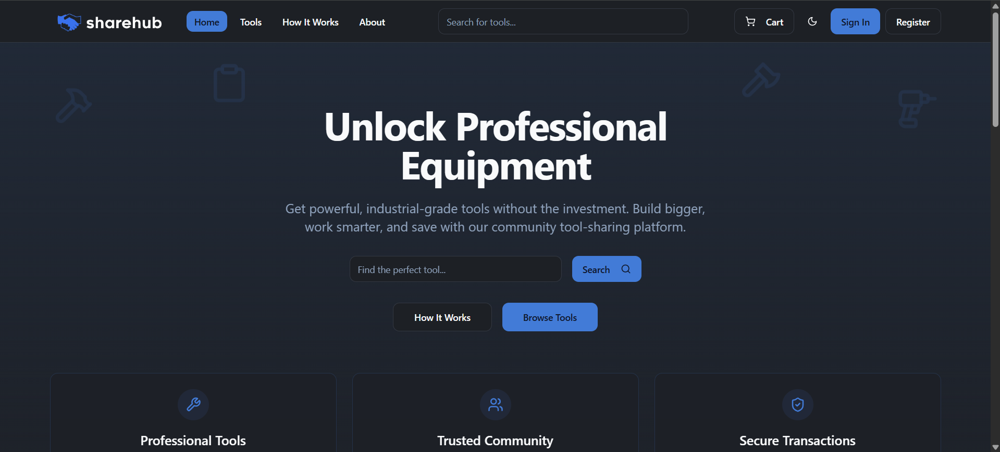
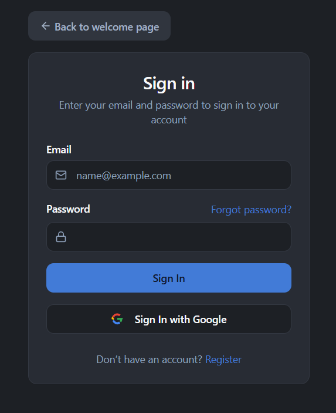
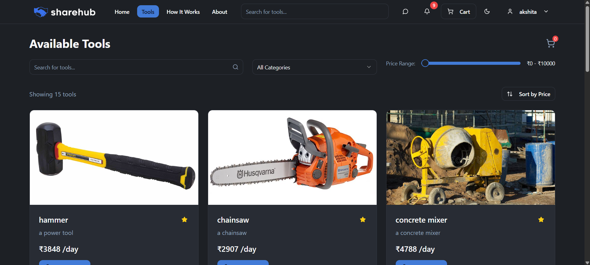
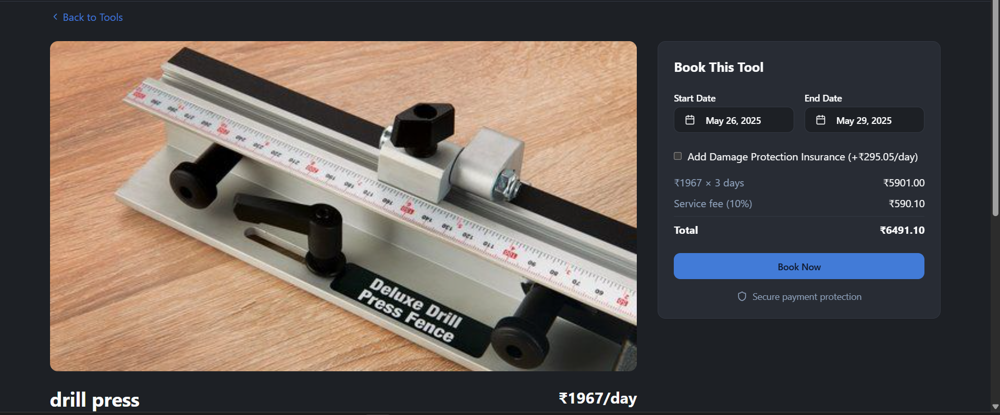

# 🛠️ Toolish ShareHub

Toolish ShareHub is a full-stack peer-to-peer tool and equipment rental platform built with the **MERN stack**. Designed for government departments, contractors, and organizations, it allows unused machinery and tools to be listed for rent. The platform supports secure authentication, booking and payment handling, real-time communication, and admin moderation.

 <!-- Replace with actual image path -->

---

## 🌟 Key Features

- 🔐 **Authentication**: Email/Password and Google OAuth via Passport.js
- 🧰 **Tool Listing**: Departments and users can add equipment with availability
- 🔎 **Tool Discovery**: Filters, categories, and search to find what’s needed
- 🛒 **Booking System**: With real-time availability and rental period tracking
- 💳 **Payments**: Razorpay integrated for secure online transactions
- 💬 **Real-time Chat**: WebSocket-powered chat system between renters and owners
- 🛠️ **Admin Panel**: View tools, users, transactions, and handle disputes
- 🔔 **Notifications**: Email and in-app notifications for booking events
- 📍 **Location-aware Tools** *(Future-ready with Google Maps integration)*

---

## 📁 Project Structure

### 📦 Frontend (`/src`)

```

components/
├─ bookings/       # BookingCard, BookingDetails, BookingFilters
├─ chat/           # ChatConversation, ChatMessages
└─ ui/             # Navbar, PaymentButton

contexts/            # AuthContext, ChatContext, NotificationContext, SocketContext
pages/               # Login, Register, Bookings, ToolDetails, Dashboard, AdminPanel
hooks/               # Custom hooks

App.tsx              # Main routing and providers
vite.config.ts       # Vite config

```

### 🖥️ Backend

```

controllers/         # Logic for auth, tools, bookings, payments, chat, notifications
models/              # Mongoose schemas
routes/              # Express API routes (auth, tool, chat, bookings, payments)
middleware/          # JWT and role protection
utils/               # Email helpers, validators, Cloudinary, etc.
passport.js          # Google OAuth config
server.js            # Entry point

````

---

## 🧪 Tech Stack

| Layer      | Tech                                |
|------------|-------------------------------------|
| Frontend   | React + TypeScript, Tailwind, Redux |
| Backend    | Node.js, Express.js, Mongoose       |
| Auth       | Passport.js, JWT                    |
| Payments   | Razorpay                            |
| Realtime   | WebSocket (Socket.io)               |
| DB         | MongoDB Atlas                       |
| Email      | Nodemailer (Gmail SMTP)             |
| Media      | Cloudinary                          |

---

## ⚙️ Environment Variables

Copy the following into your `.env` file at the backend root:

```env
PORT=5000
FRONTEND_URL=http://localhost:5173

MONGO_URI="ADD YOUR OWN"
SESSION_SECRET="ADD YOUR OWN"
ACCESS_TOKEN_SECRET="ADD YOUR OWN"
REFRESH_TOKEN_SECRET="ADD YOUR OWN"

GOOGLE_CLIENT_ID="ADD YOUR OWN"
GOOGLE_CLIENT_SECRET="ADD YOUR OWN"

RAZORPAY_KEY_ID="ADD YOUR OWN"
RAZORPAY_KEY_SECRET="ADD YOUR OWN"

EMAIL_HOST=smtp.gmail.com
EMAIL_PORT=587
EMAIL_SECURE=false
EMAIL_USER="ADD YOUR OWN"
EMAIL_PASSWORD="ADD YOUR OWN"
EMAIL_SENDER_NAME="ADD YOUR OWN"

CLOUDINARY_CLOUD_NAME="ADD YOUR OWN"
CLOUDINARY_API_KEY="ADD YOUR OWN"
CLOUDINARY_API_SECRET="ADD YOUR OWN"
````

---

## 🚀 Installation Guide

### 📌 Prerequisites

* Node.js ≥ 16
* MongoDB Atlas Account
* Razorpay Account
* Google Cloud Project for OAuth

---

### 🖥️ Local Setup

#### 1. Clone the repo

```bash
git clone https://github.com/yourusername/toolish-sharehub.git
cd toolish-sharehub
```

#### 2. Backend Setup

```bash
cd backend
npm install
cp .env.example .env     # Paste the env content above into .env
npm run dev
```

#### 3. Frontend Setup

```bash
cd frontend
npm install
npm run dev
```

Visit the app at: [http://localhost:5173](http://localhost:5173)

---

## 📷 Screenshots

| Login Page              | Tool Listing            | Booking Interface         |
| ----------------------- | ----------------------- | ------------------------- |
|  |  |  |

> Add your screenshots to an `assets/` folder and replace these filenames accordingly.

---

## 📌 APIs

* `/api/auth/*`: Register, Login, Google OAuth
* `/api/tool/*`: Add Tool, Fetch Tools, Tool Details
* `/api/bookings/*`: Create, View, Filter Bookings
* `/api/chat/*`: Send/Receive Messages
* `/api/payments/*`: Initiate and verify payments
* `/api/notifications/*`: Push notifications to users

---

## 🧭 Future Enhancements

* 📍 Google Maps API Integration
* 📲 Mobile App (React Native)
* 📊 Analytics Dashboard for Admins
* 🧾 Invoicing System
* 🔒 Role-based Access Control

---

## 🤝 Contribution

Pull requests are welcome. For major changes, please open an issue first to discuss what you would like to change.

```bash
# Clone the project
git clone https://github.com/yourusername/toolish-sharehub.git

# Create your feature branch
git checkout -b feature/amazing-feature

# Commit your changes
git commit -m 'Add some amazing feature'

# Push to the branch
git push origin feature/amazing-feature

# Open a pull request
```

---

## 📄 License

MIT License © 2025 Akshaan Angral

---

## 👋 Author

Made by **Akshaan Angral**
📧 Email: [angralakshaan@gmail.com](mailto:angralakshaan@gmail.com)
🔗 [LinkedIn](https://www.linkedin.com/in/akshaan-angral-b3569226b/) | [GitHub](https://github.com/AkshaanAngral)


```
